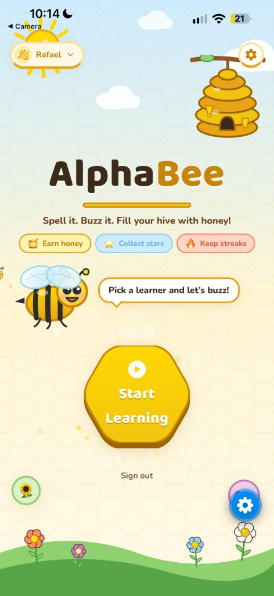
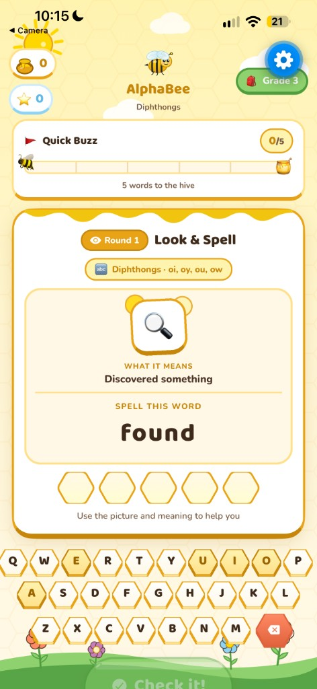
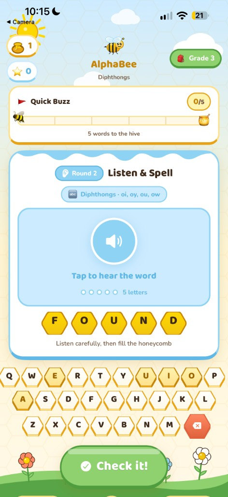

# AlphaBee

A playful, honeycomb-themed spelling game for kids — built with **React Native**, **Expo**, and **TypeScript**.

Children practice spelling through a two-round flow: first **look** at the word, then **listen** and spell it from memory. Parents and teachers can also add custom vocabulary lists.

## Screenshots

<p align="center">
  
  
  
</p>

<p align="center">
  <em>Landing &nbsp;·&nbsp; Look &amp; Spell &nbsp;·&nbsp; Listen &amp; Spell</em>
</p>

## Features

- **Landing experience** — warm cream/honey palette, animated bee circle, honeycomb CTA
- **Parent auth + child select** — adults sign in; pick or create a learner profile before play (JWT stored on device)
- **Cloud session sync** — Quest Complete posts honey/stars/words to the Postgres API (with offline local fallback)
- **Hive totals from API** — My Hive and Mode Select load lifetime honey, stars, and streak for the active child
- **Grade Level Quest** — sequenced K–5 phonics path (CVC, digraphs, blends, silent e, vowel teams, and more) plus sight-word units
- **Practice Hive** — parents/teachers enter custom weekly spelling lists
- **Look → Listen rounds** — Round 1 shows a picture + kid-friendly meaning with the word; Round 2 hides them and uses text-to-speech (`expo-speech`)  - ***SOON TO BE OPTIMIZED***
- **Sound design** — ding / buzz / hive SFX, celebration fanfare, and a quiet hive music collection (Sunny Hive, Honey Hum, Garden Buzz, Golden Morning, Bee Dance)
- **Hive Settings** — toggle sound effects, music, and word voice independently; pick a music track
- **Session quests** — Quick Buzz (5), Honey Hunt (10), or Hive Hero (15) words, then a clear finish screen
- **Daily streak** — complete one quest per day to keep your streak going (saved on device)
- **Hexagonal UI** — honeycomb letter slots, keyboard keys, and buttons (SVG)
- **Feedback & rewards** — gold flash / gentle shake, haptics, honey drops, stars, and a collectible hive

## Tech Stack

| Area | Tools |
|------|--------|
| Framework | React Native, Expo SDK 57 |
| Language | TypeScript |
| Navigation | React Navigation (native stack) |
| UI | `react-native-svg`, `expo-linear-gradient`, custom theme tokens |
| Motion | React Native `Animated` API |
| Audio / feedback | `expo-audio`, `expo-speech`, `expo-haptics` |
| Fonts | Nunito, Baloo 2 via Expo Google Fonts |
| Backend | Fastify + Prisma + PostgreSQL (`backend/`) |

### Backend (Postgres API)

Parent accounts, child profiles, progress, Practice Hive lists, streaks, and quest sessions live in `backend/`.

```bash
cd backend
npm install
npm run db:up
npm run db:push
npm run db:generate
npm run dev
```

See [backend/README.md](./backend/README.md) for the full API. The Expo client helpers are in `src/api/`.

## Getting Started

### Prerequisites

- Node.js 22+ (recommended for Expo 57)
- npm
- Expo Go on a phone, or an iOS Simulator / Android Emulator

### Install & run

```bash
npm install
npx expo start
or npm start
```

Then press:

- `i` — iOS simulator  
- `a` — Android emulator  
- `w` — web  
- Or scan the QR code with **Expo Go**

## Project Structure

```
AlphaBee/
├── App.tsx                 # Root: fonts + navigation + AudioProvider
├── app.json                # Expo config
├── scripts/
│   └── generate-audio.js   # Regenerates original SFX (not licensed music)
├── src/
│   ├── audio/              # Sound manager, music catalog, settings
│   ├── components/         # Reusable UI (Hexagon, AlphaBee, keyboard, etc.)
│   ├── screens/            # Landing, ModeSelect, Game, Settings, HiveRewards
│   ├── navigation/         # Typed stack param list
│   ├── data/               # Curriculum, quests, word cues
│   └── theme/              # Colors & typography
└── assets/
    └── audio/              # ding/buzz/hive SFX + hive music loops
```

### Screens

| Screen | Route | Purpose |
|--------|--------|---------|
| `LandingScreen` | `Landing` | Splash / main menu |
| `AuthScreen` | `Auth` | Parent sign-in / register |
| `ChildSelectScreen` | `ChildSelect` | Pick or create a learner profile |
| `ModeSelectScreen` | `ModeSelect` | Choose Grade Quest or Practice Hive |
| `SettingsScreen` | `Settings` | Sound effects, music, word voice toggles + track picker |
| `GameScreen` | `Game` | Spelling gameplay |
| `SessionCompleteScreen` | `SessionComplete` | Quest finish + streak |
| `HiveRewardsScreen` | `HiveRewards` | Progress & collectibles |

## How Gameplay Works

1. Pick **Grade Quest** (K–5) or open **Practice Hive** and add custom words.
2. **Round 1 — Look & Spell:** the word is shown; fill the honeycomb slots.
3. **Round 2 — Listen & Spell:** the same word is hidden and spoken aloud (tap to hear again).
4. Correct answers earn honey (and stars after the listen round). Visit **My Hive** to see rewards.

## Scripts

```bash
npm start          # same as npx expo start
npm run ios        # start and open iOS
npm run android    # start and open Android
npm run web        # start web
```

## Design Notes

- **Palette:** honey gold (`#F1C40F`, `#FFD700`), cream (`#FFFDD0`), dark brown text
- **Theme:** modern cartoon / friendly honeycomb motifs throughout layout and controls
- Components are modular so cards, modals, and hex controls can be reused across screens

## Music credits

Hive background music is by Kevin MacLeod (incompetech.com), licensed under
[CC BY 3.0](http://creativecommons.org/licenses/by/3.0/). Full track list:
[assets/audio/CREDITS.md](./assets/audio/CREDITS.md).


